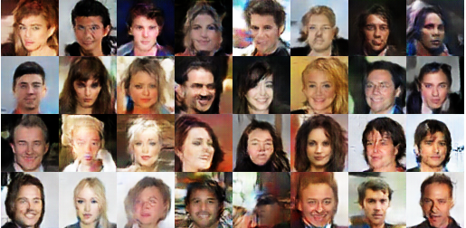

# CelebA-GANs

Implementation of Wasserstein GAN with gradient penalty ([WGAN-GP](https://arxiv.org/abs/1704.00028)). 


### Results from 1.2M Generator and 0.8M Discriminator

<p align="center">
  
    
</p>

### Installation
```
$ git clone https://github.com/Bex0n/CelebA-GANs
$ cd CelebA-GANs
$ pip install -r requirements.txt
```

### Usage
```
cd CelebA-GANs
python train.py -c <path_to_config_file>
```